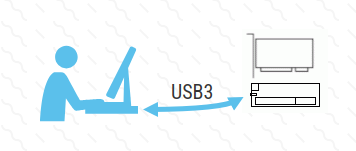
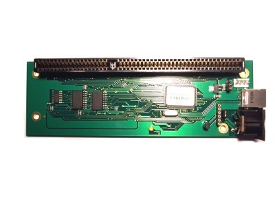
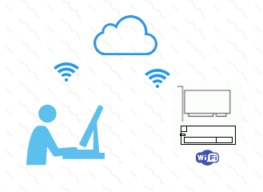
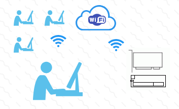
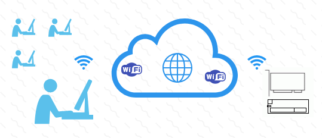
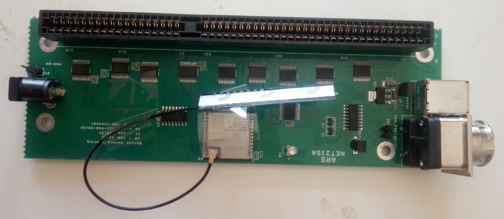

## Host hardware implementation 

### I. Background

ARS Technologies have been developing and offering interfacing products allowing use of peripheral card outside of a computer system.

Currently ARS Technologies offers USB2ISA family of products allowing use of one or more ISA cards on computer systems through USB2 inteface. These products are not ISA32bit enabled.

We are in development and will be releasing:
- USB3ISA family of products, allowing use of one or more ISA cards on computer systems through USB3 interface
- NET2ISA family of products, allowing use of one or more ISA cards on computer systems through WiFi interface

These 2 lines of products will be ISA32bit enabled.

### II. USB3ISA family

The upcoming USB3ISA products will be connected to computer systems which have USB3 host controllers, through USB cable and will handle standard ISA cards or ISA32bit enabled cards.

<picture>
  
</picture>

The computer systems connecting to USB3ISA range from laptops running desktop operating systems to 'headless' processor boards like the ARM based raspberry pi boards.

<picture>
  
</picture>

One example of a member of the USB3ISA family is USB3ISA-x1 product which will be available in the 2nd half of 2026 .

ISA32bit interface of USB3ISA will operate on the raw speed of USB3.0 - 5Gbit/s. 

### III. NET2ISA family

The upcoming NET2ISA products will be connected to computer systems through WiFi wireless connection  and will handle standard ISA cards or ISA32bit enabled cards.

NET2 products can operate in 3 different modes:
- Access point mode
- Local connection mode
- Global connection mode

<picture>
  
</picture>

The 'Access point' mode is the initial mode in which a new NET2 device operates. When a new NET2 device is powered on it creates its own access point and a computer system which want to connect to the NET2 device has to join the access point created by the NET2 device. 

<picture>
  
</picture>

Normally the computer systems connects to a local access point based on modem/router which forms a local network and also gives it access to internet - globally. A NET2 device which was given the WiFi network id and password can connect to the local network and be assigned a local IP address as well.

<picture>
  
</picture>

In global communication mode the computer system(s) are connected to one WiFi network and the NET2 device is connected to another WiFi network. In this mode consideration should be given to latency because of the distance.
A signal moving at the speed of light (300,000km/s) will take 10ms to travel 3,000km. For ex. a signal traveling from New York city to Los Angeles will take close to 15ms.

One example of a member of the NET2ISA family is NET2ISA-x1 product which will be available in the 2nd half of 2026 .

<picture>
  
</picture>

