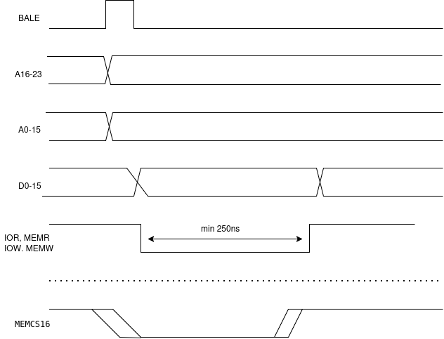
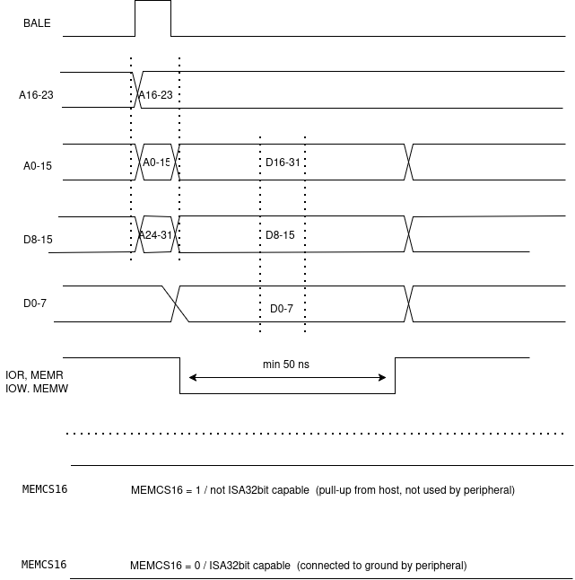
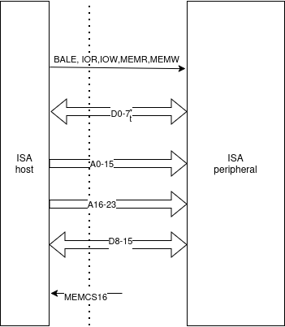
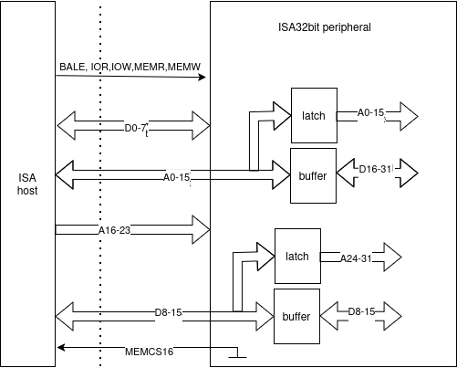

 ## Chapter 2 - Timing diagrams and hardware interface

### I. The original ISA bus timing diagram:

<picture>
  
</picture>

In this diagram the BALE notifies peripheral about the address cycle, and after it goes from level high to low the addresses are stable / not changing.

The data cycle signals - IOR,IOW,MEMR,MEMW remain level low for a minimum period of 250ns (zero wait state). Normal ISA bus data cycle is 1 wait state - 500ns.

By definition the MEMCS16 (Memory Chip Select 16) signal is driven low by the ISA peripheral to indicate it is capable of performing a 16-bit memory data transfer. 

However in many ISA peripherals it is not driven/used because the software and the host is requesting 16bit operation on a peripheral which it knows in advance is capable of 16bit transfers.

### ISA32bit bus timing diagram

 <picture>
  
</picture>
     
 In this diagram the MEMCS16 is either connected to ground indicating ISA32bit capable peripheral, or driven to level high (when not active) or not driven/used by peripheral but pulled up high by host.

 At power on time, if the MEMCS16 is high then the host will provide the original ISA bus signaling and deal with the ISA peripheral as a 8/16bit capable only.

 At power on time, if the MEMCS16 is low, driven by peripheral connecting this signal to ground,  then the host will provide the ISA32bit bus signaling and deal with the ISA peripheral as a 8/16/32bit capable.   
   
 During the time the BALE signal is high the host provides the A0-23 addresses on the standard ISA bus lines, and A24-31 on the D8-15 ISA bus lines. However these signals are valid only during the time BALE is high. 

 The ISA32bit capable peripheral must latch the A0-15 signals and (optionally) A24-31 signals for the data phase of the read/write cycle.

 For most computer peripherals directly addressing 16 Mbytes (using A0-23) is more than enough. The A24-31 addresses are used to place the peripheral in a specific region of the 32bit computer address space. 

 However the host hardware and software may not be connected to the address space of a computer system and in this case latching of the A24-31 signals (coming on D8-15) for the data phase of the read/write cycle is optional.

 During the data phase (one of IOR,IOW,MEMR,MEMW is low) the ISA32bit capable peripheral has to get the D16-31 signals from the ISA bus A0-15 signals.

 The data cycle signals - IOR,IOW,MEMR,MEMW can remain level low for a minimum period of 50ns. The host hardware may provide even shorter period, for es. 25ns.

### ISA32bit bus timing diagram

 <picture>
  
</picture>

In the ordinary ISA bus, as on the picture above, the host provides and the peripheral relies on address signals are stable/not changing during the data cycle.

In the ISA32bit bus, as on the picture below, the host provides A0-15 and A24-31 address signals during the time BALE signal is high/active. In this time the ISA32bit peripheral has to latch these address signals with additional logic/chips.

<picture>
  
</picture>

During the data cycle with signals IOR,IOW,MEMR,MEMW being low, the ISA32bit peripheral will additional logic/chips for data buffers for the D16-31, coming from host A0-15 signals.

The ISA32bit peripheral ties MEMCS16 to ground to indicate to host that it is ISA32bit capable.

   ## Next:
### [Chapter 3 - Software interface and API set](chapter3.md)

   ## Appendix
### [1. Host hardware implementation](appendix1.md)    
### [2. Sample software and libraries to build on: Windows, Mac OS, Linux](appendix2.md)

        Join our project - Become a contributor and/or implementer and/or user of ISA32bit
          
        You are welcome to contact us and/or share about our project 

Contributors: Paul Arssov / paul@arstech.com 

